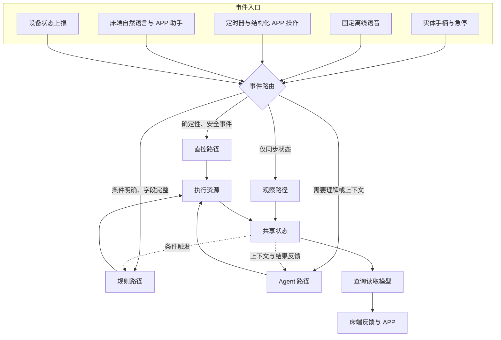
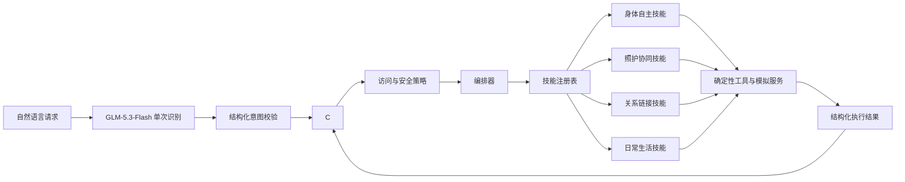
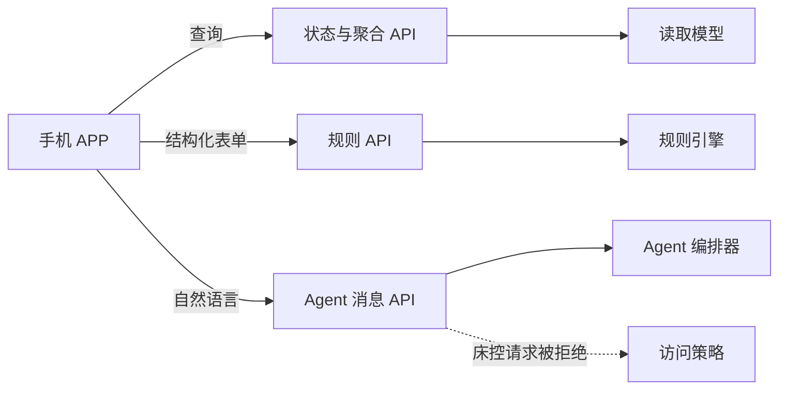

# 护理床 Agent 架构

## 设计目标

这里描述的是 Agent 的功能结构和运行边界，不是产品需求清单。核心目标是把复杂的多入口、多能力和多资源关系压缩成少数稳定层次，同时保证 Agent 不过度介入确定性控制。

## 总体结构

系统采用“先分流、后处理、再汇总状态”的结构。入口与能力不直接一一绑定，而是先归一成事件，再由路由器选择处理路径。

四条路径的职责如下：

| 路径 | 适用事件 | 是否进入 Agent | 例子 |
|---|---|---|---|
| 直控 | 低延迟、确定性、安全相关 | 否 | 手柄升降、急停、安全信号 |
| 规则 | 结构完整、条件固定 | 否 | 定时提醒、固定语音停止、APP 表单创建提醒 |
| Agent | 自然语言、模糊表达、上下文和组合任务 | 是 | “再高一点”“提醒我晚上吃药”“播放儿子的留言” |
| 观察 | 外部权威状态同步 | 否 | 电机位置、故障和运动状态上报 |

## Agent 内部

Agent 内部职责被拆成六个稳定部件：

1. **意图解释器**：每条普通自然语言请求都调用 GLM，并把受约束的 JSON 转换为 `Intent`；生产路径不使用关键词模板。
2. **上下文存储**：保存必要的短期上下文，目前支持床体连续微调中的目标承接。
3. **访问策略**：在技能执行前判断来源和权限，例如拒绝 APP 远程床控。
4. **编排器**：按“识别—上下文—策略—技能—结果”的顺序协调处理。
5. **技能注册表**：根据意图找到对应功能域，避免入口直接连接每个底层资源。
6. **执行结果**：统一返回 `status`、`code`、`message` 和 `data`，供语音反馈与 APP 展示。

当前没有引入重量级“统一任务对象”。`Intent` 位于理解与决策之间，`ExecutionResult` 位于执行与反馈之间，已经足以隔离多对多关系；后续出现跨时长、多步骤和可恢复任务时，再增加持久化任务模型。

## 模型接入边界

- 模型适配器使用 `glm-5.3-flash` 的 Chat Completion API，并从 `GLM_API_KEY` 读取认证信息。
- 意图识别使用 `reasoning_effort=low`、非流式 JSON 和 15 秒超时的独立低延迟配置。
- 推理内容不会进入用户回复，也不会作为床控参数使用。
- 模型输出先校验意图、动作、参数、否定状态、执行意愿和置信度，随后仍需经过上下文、访问策略、技能和确定性工具。
- 轻量陪聊回复包含在同一次意图 JSON 中，不再发起第二次模型请求。
- 未配置密钥、网络异常、低置信度或返回格式错误时不回退关键词规则，也不执行动作。
- 实体手柄、急停、安全信号、定时器和结构化 APP 操作继续绕过模型。
- 适配器支持 `messages[].content[]` 中的 `image_url`，但当前 APP 契约暂未开放图片输入。

## 功能域与资源

| 功能域 | Agent 技能 | 当前执行资源 |
|---|---|---|
| 身体自主 | 床体调节、情景姿态、连续微调、停止 | 确定性床控器、共享床体状态 |
| 照护协同 | 护理提醒、护理记录、护理 Todo、应急呼叫 | 内存存储、通知出口、模拟通话 |
| 关系链接 | 实时通话、非实时留言、生日查询与祝福 | 模拟通话、留言存储、纪念日存储 |
| 日常生活 | 今日事项、天气、帮助记事、轻量陪聊、点播 | 聚合读取模型、GLM、演示天气、记事存储、模拟媒体 |

技能描述用户目标，工具和服务负责实际动作。一个技能可以组合多个资源，一个资源也可以被多个技能复用，因此不需要在图上画出所有入口到能力的交叉连线。

## 状态闭环

- 所有路径的结果最终写入或读取共享状态与领域存储。
- Agent 只能根据工具返回的真实结果生成反馈，不能假定执行成功。
- `DemoReadModel` 聚合提醒、待办、纪念日和演示状态，向 APP 提供稳定查询结构。
- APP 通过查询接口刷新页面，通过结构化接口提交明确操作，通过消息接口提交自然语言。

## APP 边界

- APP 和 Agent 分开开发，唯一共享物是 `contracts/openapi.json`。
- APP 不依赖意图类型、技能类或内部存储结构。
- APP 的结构化操作不必绕行 Agent。
- APP 仅展示床体状态，不提供远程床控；床端语音和实体手柄保留独立控制权。

## 当前演示边界

- 已实现四个功能域及其示例语句。
- 配置 API Key 后，普通自然语言统一由 GLM 识别；无密钥时自然语言安全失败，确定性路径继续可用。
- 通话、媒体、天气和应急呼叫为模拟实现，不连接真实供应商或医疗报警系统。
- 领域数据保存在内存中，进程重启后清空；留言和生日包含少量种子数据。
- 后续接入真实资源时，应替换工具适配器，尽量不修改技能接口和 APP 契约。
