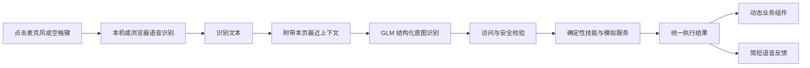

# 智能护理床语音演示重构设计

## 目标

复用现有 `app/` React 前端和 `agent/` Python 服务，将 `/voice-demo.html` 重构为适合电脑浏览器投屏的单页演示。核心闭环是：

1. 用户点击麦克风或按空格键说话；
2. 页面获得识别文本；
3. GLM 将当前话语识别为受约束的结构化意图；
4. Agent 将意图映射到确定性的演示能力；
5. 右侧舞台切换为对应的真实感业务组件；
6. 页面和系统语音共同反馈处理结果。

本项目只验证语音理解与能力调度的产品体验，不连接真实护理床、医疗系统、联系人、天气或媒体服务，也不扩建为完整 Agent 平台。

## 已确认边界

- 运行环境：电脑浏览器投屏，优先适配 16:9 大屏。
- 输入方式：点击麦克风或按空格键开始语音输入；文字输入作为稳定兜底。
- 技术复用：保留现有 React、Vite、Windows 本机中文语音识别、浏览器识别回退、GLM 接入、Agent 路由、安全确认和模拟服务。
- 视觉方向：医疗级温和科技；明亮、克制、可靠、用户友好。
- 页面结构：双舞台，左侧固定语音交互，右侧动态展示当前服务。
- 智能表达：弱化机器人、模型、置信度、工具调用和推理术语，用自然反馈体现智能。
- 床体视觉：不绘制写实或低质量床体插画；使用姿态名称、当前值、目标值、进度和安全状态表达床控。
- 数据边界：不使用 SQL、`localStorage` 或其他永久存储。
- 身份边界：不做声纹识别，不区分老人、家属和护理员。

## 产品叙事原则

参考 Apple HomePod、Eight Sleep、Oura 和 Stryker ProCuity 的公开产品表达，页面不把能力架构直接做成菜单或功能墙：

- 先展示用户正在经历的状态和结果，再展示系统能力。
- 待机时展示少量真实生活信息，例如下一项护理、最新留言、天气和当前安全状态。
- 语音触发后，只让当前能力成为右侧主角，其他信息降级为环境状态。
- 完整功能清单放入“演示指南”抽屉，供演示者快速选择话术，不占用主画面。
- 不使用“Agent 推理”“工具调用”“大模型置信度”等面向实现的语言。

## 页面布局

### 顶栏

顶栏保持低存在感，包含产品名称、当前时间、服务连接状态和“演示环境”标记。返回家属端入口放入次级菜单，避免干扰现场演示。

### 左侧语音舞台

左侧在所有状态下保持稳定，避免观众失去操作入口：

- 待机：欢迎语、麦克风按钮、空格键提示和两条轮换示例。
- 监听：明显但克制的声波动画和实时转写。
- 理解：显示用户原话和“正在理解您的需要”。
- 处理：使用“已听懂”“正在确认安全”“正在为您处理”三个自然步骤。
- 结果：播报一句简短结果，并允许继续发出关联指令。
- 错误：保留原话，提供重试和文字输入，不把失败伪装成成功。

空格键只在焦点不位于输入框、按钮或可编辑控件时触发，防止与正常键盘操作冲突。

### 右侧服务舞台

右侧是视觉重点。待机时显示“今日照护概览”，不画护理床：

- 当前状态：床体静止、安全状态正常；
- 下一项护理：具体时间和事项；
- 家人联系：最新留言或最近通话；
- 日常信息：天气或今日事项。

收到语音后，右侧通过平滑淡入和尺寸过渡切换到对应业务组件。组件不跳转页面，完成后保留结果，方便观众理解本次调用。

### 演示指南

右上角提供可关闭的“演示指南”抽屉，按用户语言组织示例，而不是按技术模块组织。示例包括“调节身体姿势”“安排照护”“联系家人”“处理日常小事”。点击示例只填入输入框，不自动执行，防止误触打断讲解。

## 动态业务组件

### 身体自主

- 床体调节：展示姿态名称、调节部位、当前值、目标值、进度、安全锁和“随时说停止”。
- 情景姿态：以“用餐姿势”“看电视姿势”“舒适平躺”等预设卡表达，不画床体。
- 大幅动作：出现明确的确认卡；确认和取消同时支持语音与按钮。
- 紧急停止：立即切换为高优先级停止结果，不等待确认。

### 照护协同

- 护理提醒：时间、内容、提醒方式和确认按钮。
- 护理记录：转写后的记录内容、记录时间和保存状态。
- 应急呼叫：使用高对比但不过度惊吓的呼叫面板，展示正在联系护理人员、呼叫状态和取消入口。
- 护理 Todo：使用今日清单、完成状态和下一项时间。

### 关系链接

- 实时通话：联系人头像或首字、呼叫状态、波形、计时和挂断按钮。
- 非实时留言：留言发送者、时间、摘要、播放进度或录制状态。
- 纪念日祝福：联系人、日期、关系和简短祝福建议，不使用夸张庆典动画。

### 日常生活

- 今日事项：按时间排序的简洁时间线。
- 天气：当前温度、天气、最高最低温和一条照护相关建议。
- 帮助记事：便签内容、记录时间和保存状态。
- 轻量陪聊：自然的单轮或短上下文回复，不显示聊天机器人头像。
- 点播：封面色块、内容标题、播放状态、进度和暂停入口，不依赖真实版权媒体资源。

## 会话内短期上下文

短期上下文只为连续语音提供必要理解，例如“再高一点”“取消刚才的提醒”“继续播放”。

- 页面加载时在内存生成新的会话标识；刷新页面即获得全新会话。
- React 状态仅保留最近 8 轮用户话语和系统结果，不写入本地持久化存储。
- 每次自然语言请求携带最近上下文给 Agent；上下文只帮助解释当前话语，不能被当成新的执行命令。
- Agent 的待确认动作和最近床控目标使用本次页面的会话标识隔离。
- 页面刷新后旧会话不再可访问；服务端不建立数据库，也不提供历史会话列表。
- UI 只显示“本次对话”及最近交互，不宣传“长期记忆”或“多人识别”。

## 数据流

模型只负责理解当前话语和必要指代。安全确认、权限、状态变化、组件选择和模拟结果均由确定性代码控制。

## 前端结构

保留 `/voice-demo.html` 入口，拆分现有大型页面：

- `VoiceDemoApp`：会话状态、语音输入、请求和全局键盘事件。
- `VoiceConsole`：左侧语音舞台。
- `ServiceStage`：根据执行结果选择右侧组件。
- `IdleOverview`：待机态今日照护概览。
- `BedControlView`、`CareServiceView`、`RelationshipView`、`DailyLifeView`：领域内真实感组件。
- `DemoGuide`：隐藏式演示话术抽屉。
- `servicePresentation`：把后端 `code`、意图和数据转换为稳定的展示模型。

组件映射优先使用后端返回的 `code` 和结构化数据，不再依赖前端关键词判断。现有 `intentEngine.ts` 仅保留类型和演示展示适配所需部分，避免前后端出现两套意图识别。

## 错误与安全

- Agent 未连接：右侧显示连接提示，文字和语音原话保留，可重试。
- 麦克风不可用：自动回退浏览器识别；仍不可用时聚焦文字输入。
- LLM 超时或低置信度：不执行能力，要求用户换一种说法。
- 医疗诊断、药量调整和医嘱变更：明确拒绝并建议联系医护人员。
- 床体大幅动作：继续使用二次确认；停止始终最高优先级。
- 所有动作均显示“演示模拟”，不暗示已控制真实设备。

## 视觉规范

- 主色使用低饱和青绿色，背景为暖灰白，危险状态使用克制的珊瑚红。
- 卡片边框与阴影轻量，避免玻璃拟态、霓虹、发光机器人和过度渐变。
- 标题和关键结果保证投屏远距离可读；辅助信息减少字号层级。
- 动画只服务于状态变化：监听波形、组件切换、进度和确认，不做持续装饰动画。
- 图标使用现有 Lucide 图标；人物使用首字头像或简单色块，不依赖外部图片。

## 测试与验收

- 空格键可开始和停止语音，输入框聚焦时不会误触。
- 页面刷新后历史清空，新会话不会继承之前的确认动作或床控指代。
- 四类需求均至少有一个可完整演示的动态组件。
- 用户列出的全部功能均有稳定的结果映射和演示话术。
- 二次确认、取消、紧急停止、医疗限制和服务异常均有明确界面。
- 语音、文字和示例入口最终走同一条 Agent 请求链路。
- 大屏 1440×900、1920×1080 下无需滚动即可完成核心演示。
- 现有前后端测试继续通过，并为键盘交互、会话上下文和组件映射补充测试。

## 非目标

- 不接真实床控硬件、电话、天气、媒体或护理系统。
- 不做声纹识别、多人角色识别、长期记忆、账户体系或数据库。
- 不做自主规划、复杂工具链、RAG 或多 Agent 协作。
- 不把该演示包装成医疗诊断或真实安全系统。
